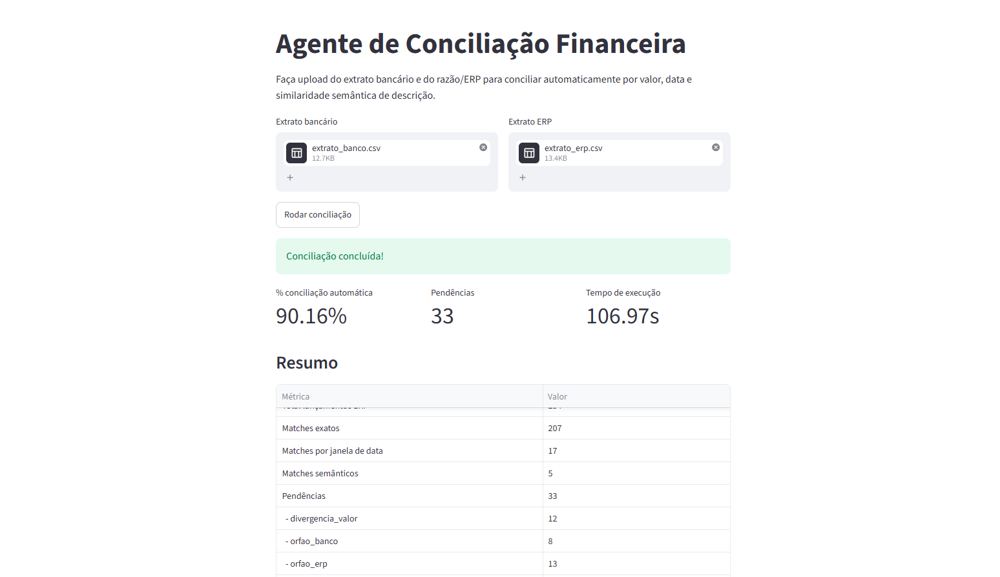
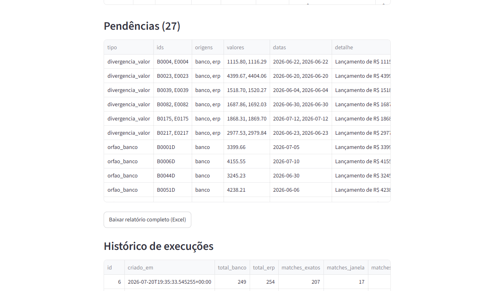

# Agente de Conciliação Financeira

Um agente que concilia extrato bancário e ERP sem precisar de match exato — e explica
cada pendência como um analista explicaria.

## O problema

Toda empresa que opera com múltiplas fontes de lançamento financeiro (extrato
bancário, ERP, planilha de contas a pagar/receber) perde horas conciliando
manualmente. O problema não é só bater valores exatos: nomes de fornecedores vêm
grafados de formas diferentes, datas têm defasagem de compensação, e um mesmo
pagamento pode aparecer dividido ou agrupado nos dois lados. Conciliação por
igualdade exata de string ou valor falha nesses casos.

## Como funciona

O matching é feito em camadas, cada uma pegando o que sobrou da anterior:

1. **Match exato** — mesmo valor + data (+ referência, quando existe).
2. **Match por janela** — mesmo valor, data com defasagem de até N dias.
3. **Match semântico** — similaridade de n-gramas de caracteres (TF-IDF, via
   scikit-learn) compara a descrição dos lançamentos que sobraram, casando por
   similaridade dentro de uma tolerância de valor/data mais ampla. Não é um
   embedding semântico "de verdade" — é uma aproximação leve o suficiente pra
   rodar em ambientes com pouca memória, adequada pro caso de uso (descrições
   que divergem na formatação, não no significado).
4. O que não casa em nenhuma camada vira **pendência classificada**
   (`divergencia_valor`, `orfao_banco`, `orfao_erp`, `duplicidade`) com uma
   explicação em linguagem natural gerada por LLM (OpenRouter,
   `meta-llama/llama-3.3-70b-instruct`) — todas as pendências são explicadas numa
   única chamada em lote, não uma por uma, pra não esbarrar em limite de taxa.

```
extrato_banco.csv ─┐
                    ├─► ingestão/normalização (Pandas) ─► match exato ─► match janela ─► match semântico ─► pendências + explicação (OpenRouter) ─► relatório Excel
extrato_erp.csv ────┘
```

## Stack

- **Python** + **Pandas** — ingestão e normalização.
- **Pydantic** — modelos de dados (`Lancamento`, `Pendencia`, `ResultadoConciliacao`).
- **scikit-learn** (TF-IDF + similaridade de n-gramas) — matching semântico leve,
  sem custo de API e sem depender de modelos pesados (torch).
- **OpenRouter** (`meta-llama/llama-3.3-70b-instruct`) — geração de explicações em
  linguagem natural, em uma única chamada em lote para todas as pendências.
- **openpyxl** — relatório final consolidado em `.xlsx`.
- **Streamlit** — interface de upload e visualização.
- **Supabase** (Postgres) — histórico de execuções (opcional).
- **Render** — deploy da interface.

## Como rodar

### 1. Instalar dependências
```bash
pip install -r requirements.txt
```

### 2. Configurar a chave do OpenRouter (opcional, mas recomendado)
Crie uma conta e uma chave em [openrouter.ai](https://openrouter.ai/keys) (precisa de
créditos — o modelo usado é pago, mas barato) e copie `.env.example` para `.env`,
preenchendo `OPENROUTER_API_KEY=sua_chave`. Sem a chave, o pipeline funciona
normalmente — só não gera a explicação em linguagem natural das pendências (fica só
o detalhe técnico).

### 3. Configurar o histórico no Supabase (opcional)
Rode o SQL de `docs/schema.sql` uma vez no **SQL Editor** do seu projeto Supabase
para criar a tabela `execucoes_conciliacao`. Depois, em **Settings → API**, copie a
**service_role key** (não a `anon`) e preencha no `.env`:
```
SUPABASE_URL=https://seu-projeto.supabase.co
SUPABASE_SERVICE_ROLE_KEY=sua_service_role_key
```
Sem isso configurado, o pipeline funciona normalmente — só não registra/mostra o
histórico de execuções.

### 4. Gerar dados sintéticos de teste
```bash
python scripts/gerar_dados.py
```
Gera `data/raw/extrato_banco.csv`, `extrato_erp.csv` e `gabarito.csv` (~250
lançamentos por lado, com nomes divergentes, duplicidades, órfãos e divergências de
centavos inseridos de propósito).

### 5. Rodar via linha de comando
```bash
python scripts/rodar_pipeline.py
```
Imprime o resumo no terminal e gera `data/output/relatorio_conciliacao.xlsx`.

### 6. Ou rodar via interface web
```bash
streamlit run app.py
```
Upload dos dois arquivos, clique em "Rodar conciliação", veja o resumo e as tabelas
na tela, e baixe o relatório Excel.

**Resultado na interface:**





## Estrutura do projeto

```
src/conciliacao/
  models.py               # Pydantic: Lancamento, Pendencia, MatchSemantico, ResultadoConciliacao
  ingestao.py              # leitura CSV/XLSX + normalização de datas/valores/descrições
  matching.py               # camada 1 (exato), camada 2 (janela) e classificação de pendências
  embeddings.py              # vetorização TF-IDF (n-gramas de caracteres)
  matching_semantico.py       # camada 3 (semântica)
  explicacao.py                 # geração de explicação em LN via OpenRouter (lote)
  persistencia.py                # histórico de execuções (Supabase)
  relatorio.py                   # monta o relatório Excel consolidado
  pipeline.py                     # orquestra ingestão -> matching -> resultado
  gerar_dados.py                   # gerador de dataset sintético (Faker)
scripts/
  gerar_dados.py             # CLI: popula data/raw/
  rodar_pipeline.py           # CLI: roda o pipeline completo
app.py                         # interface Streamlit
tests/                          # pytest — cobre ingestão, matching e explicação
```

## Métricas (dataset sintético, ~250 lançamentos por lado)

| Camada | Resolvidos |
|---|---|
| Match exato | 207 |
| Match por janela de data | 17 |
| Match semântico | 5 |
| **Total conciliado automaticamente** | **90,16%** |
| Pendências restantes | 33 (12 divergência de valor, 8 órfãos banco, 13 órfãos ERP) |

## Limitações conhecidas

- A classificação de **duplicidade** só identifica pares que ficam *ambos* sem match
  determinístico (duas linhas idênticas do mesmo lado sobrando). Se o lançamento
  original já casou por match exato, a cópia duplicada acaba entrando como órfã em
  vez de duplicidade — heurística suficiente para o MVP, não detecção completa.
- O "tempo manual estimado" do relatório é uma estimativa documentada (minutos por
  lançamento revisado manualmente), não uma medição real.
- O matching semântico usa TF-IDF (similaridade textual), não embeddings semânticos
  de um modelo treinado — troca feita para caber no free tier do Render (512MB de
  RAM), que não comportava `sentence-transformers`/`torch`. Funciona bem para
  divergência de formatação (o caso mais comum aqui), mas não captura similaridade
  de significado entre descrições muito diferentes na escrita.
- As explicações são geradas numa única chamada em lote (todas as pendências de
  uma vez), não uma por pendência — muito mais rápido e evita bater limite de taxa,
  mas se essa chamada falhar (após as tentativas automáticas), nenhuma pendência
  daquela execução recebe explicação (fica só o `detalhe` técnico), em vez de
  falhar parcialmente.

## Deploy

O app pode ser publicado no [Render](https://render.com) sem depender do terminal
local ficar aberto:

1. Rode `docs/schema.sql` no SQL Editor do Supabase (se ainda não rodou).
2. Suba o projeto para um repositório no GitHub.
3. No painel do Render: **New → Blueprint**, conecte o repositório — ele detecta o
   `render.yaml` já presente na raiz do projeto e configura o Web Service
   automaticamente (build, start command, porta).
4. Preencha as variáveis de ambiente no painel do Render (não vêm do repositório,
   por segurança): `OPENROUTER_API_KEY`, `SUPABASE_URL`, `SUPABASE_SERVICE_ROLE_KEY`.
5. Deploy. A URL pública fica disponível no painel do Render.

## Fora de escopo (v1)

- Conciliação multi-moeda.
- Integração direta com banco (Open Finance) — v1 usa upload de arquivo.
- Aprendizado contínuo (feedback loop de correções do usuário).
